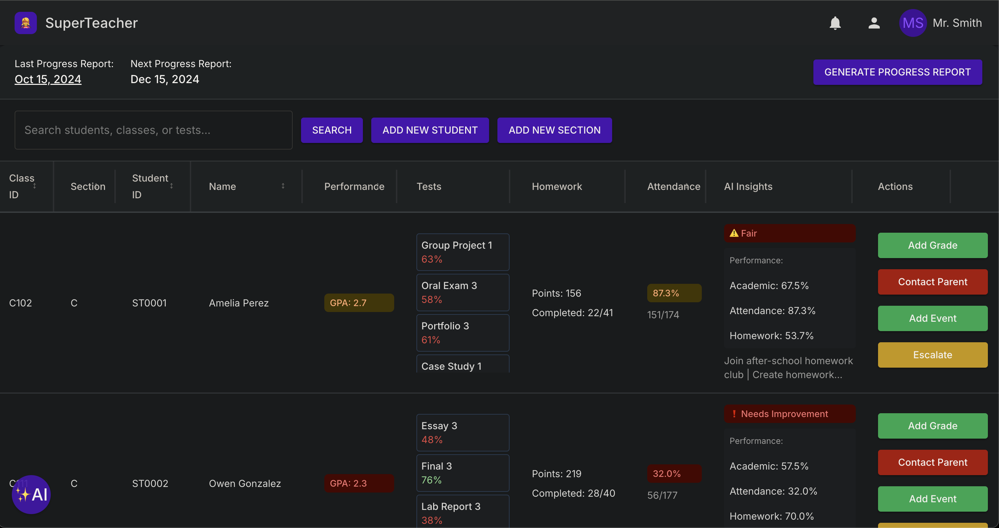

# Super Teacher

A powerful web application designed to help teachers leverage AI to enhance student learning outcomes while saving time and reducing stress. This innovative platform combines classroom management with AI-powered insights to create a more efficient and effective teaching experience.

[try it out here](https://console.cloud.google.com/run/detail/us-central1/edutrack/metrics?project=portfolio-383615) 

## Features

### Current Features
- **AI-Powered Chat Assistant**: Get instant help with lesson planning, student engagement strategies, and classroom management
- **Student Progress Tracking**: Monitor individual student performance and identify areas needing attention
- **Grade Management**: Easy-to-use interface for recording and analyzing student grades
- **Classroom Organization**: Manage multiple sections and students efficiently
- **AI Insights**: Receive personalized recommendations for each student based on their performance data
- **Progress Reports**: Generate comprehensive student progress reports automatically

### Coming Soon
- **Lesson Plan Generator**: AI-assisted creation of engaging lesson plans tailored to your teaching style
- **Behavioral Analytics**: Track and understand student engagement patterns
- **Parent Communication Portal**: Streamline parent-teacher communication
- **Assignment Generator**: Create customized assignments based on student needs
- **Resource Library**: Access a curated collection of teaching materials and resources
- **Integration with Popular Learning Management Systems**: Seamless data sync with existing educational platforms

## Technical Overview

### Architecture
- **Frontend**: Modern React application with Material-UI components
- **Backend**: FastAPI-powered Python backend with SQLite database
- **Deployment**: Containerized with Docker, deployable to Google Cloud Platform

### Tech Stack

#### Frontend
- React 18
- Material-UI (MUI)
- React Router
- Vite for build tooling
- Context API for state management

#### Backend
- FastAPI
- SQLAlchemy ORM
- SQLite database
- Python 3.x

#### DevOps
- Docker containerization
- Google Cloud Platform deployment
- Automated CI/CD pipeline

For detailed setup instructions and documentation:
- [Frontend Documentation](./frontend/README.md)
- [Backend Documentation](./backend/README.md)
