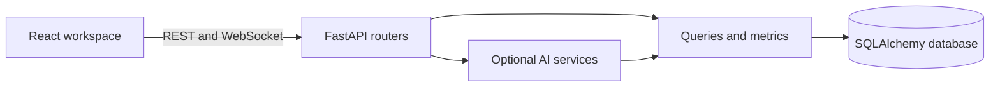

# Super Teacher

A teacher workspace for finding students who need attention and acting on grades, attendance and classroom notes. Built with React, TypeScript and FastAPI.


## Workspace

- **Today and roster:** class summaries, risk reasons, search, filters and CSV import.
- **Student and gradebook:** assignment scores, grade history, notes and spreadsheet-style score entry.
- **Attendance and reports:** daily roll call, assignment statistics, CSV export and editable parent-update drafts.
- **Ask AI:** streamed chat with scoped classroom tools and student insights. Rule-based insights and template parent drafts work without an API key; chat reports that AI is unavailable.
- **Authentication:** shared passcode by default; optional email-link accounts with owner-scoped data, revocable sessions, quotas, export and deletion.

The current React app lives in `web/`, with the API in `superteacher/`. The public domain may serve the older `edutrack` app: source capabilities are not deployment evidence. Read the [release checkpoint](docs/RELEASE_CHECKPOINT.md) and [deployment status](docs/DEPLOYMENT_STATUS.md) before making release decisions.

## Architecture


```mermaid
flowchart LR
  UI[React workspace] -->|REST and WebSocket| API[FastAPI routers]
  API --> Data[Queries and metrics]
  Data --> DB[(SQLAlchemy database)]
  API --> AI[Optional AI services]
  AI --> Data
```

[Architecture and data boundaries](docs/architecture.mdx) · [Teacher flows, frontend and authentication](docs/teacher-workspace.mdx) · [Roadmap](docs/ROADMAP.md)

## Local development

Use Python 3.11+ and Node 22.12+. The Docker runtime pins Python 3.12; frontend dependencies are locked with npm.

```bash
python -m venv .venv
source .venv/bin/activate
pip install -r requirements-dev.txt
(cd web && npm ci)
export AUTH_DISABLED=true  # local development only
./local_test.sh            # API :8080; UI http://localhost:4000
```

Local settings default to synthetic demo seeding. Use `SEED_DEMO_DATA=false` for an empty workspace. `ANTHROPIC_API_KEY` is optional; keep credentials outside Git. To exercise passcode login, set `AUTH_PASSWORD` and unset `AUTH_DISABLED`. See [configuration and deployment](docs/DEPLOYMENT.md) for accounts, email and runtime settings.

## Validation and operations

Start with the [operator runbook](docs/OPERATOR_RUNBOOK.md) for deployment, rollback, recovery, credential rotation and incident triage.

CI runs Python lint/tests, web lint/types/tests/build, browser/E2E tests, Docker/auth smoke and a benchmark. Run relevant checks after changes; in shared agent workspaces, use the repository's verification owner and resource gate for broad suites, builds and installs.

```bash
ruff check . && ruff format --check .
python -m pytest
(cd web && npm run lint && npm test -- --maxWorkers=2 && npm run build)
```

[Browser suite](e2e/FINDINGS.md) · [Backup and recovery](docs/BACKUP_RECOVERY.md) · [Dependency locking](scripts/update_lock.sh) · [Architecture decisions](docs/adr/README.md)

The accepted Cloud Run pilot uses single-writer SQLite with Litestream/GCS recovery. Release promotion requires verified writer drain, compatible migration lineage and recovery; optional email accounts also need working delivery. Follow the existing [release checklist](docs/RELEASE_CHECKLIST.md). Roles/organisations, shared multi-instance rate limiting and broader grading policies remain roadmap work.
