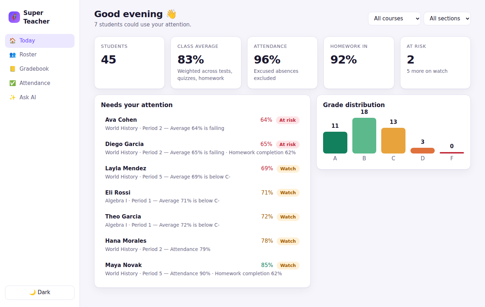
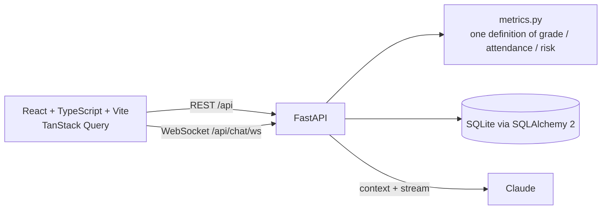

# 🦸 Super Teacher

A classroom copilot: it answers **"who needs me today, and why?"** — then helps you act on it.



## What it does
- **Today** – class stats, a ranked *needs attention* list with plain-language reasons, grade distribution.
- **Roster** – searchable, sortable, filter by status, CSV import; every student has a computed average, trend, attendance and homework rate.
- **Student** – score trend, attendance strip, every assignment (missing ones flagged), private notes, and an AI insight card.
- **Gradebook** – spreadsheet-style entry per section; averages and risk update live.
- **Attendance** – one-tap daily roll call, optimistic UI.
- **Reports** – class statistics per assignment, attendance-by-day, gradebook CSV export (injection-safe), and AI-drafted parent updates you edit before sending.
- **Ask AI** – streaming Claude chat with tools (`find_students`, `get_student`, `class_stats`) that queries your real data, so answers are grounded and scale past a prompt-sized roster.

## Architecture

```mermaid
flowchart LR
  UI[React + TypeScript + Vite<br/>TanStack Query] -- REST /api --> API[FastAPI]
  UI -- WebSocket /api/chat/ws --> API
  API --> M[metrics.py<br/>one definition of grade / attendance / risk]
  API --> DB[(SQLite via SQLAlchemy 2)]
  API -- context + stream --> C[Claude]
```
Data model: `Course → Section → Student`, with real `Assessment`/`Score` and `AttendanceRecord` rows plus `Note` and a fingerprint-keyed `InsightCache`. Everything shown in the UI is *derived* from those rows in `superteacher/metrics.py`, so the roster, the student page, the overview and the AI context can't disagree.

AI: chat streams from `ANTHROPIC_MODEL` (default `claude-sonnet-5-5`) with the roster snapshot as a prompt-cached system block; insight cards use `ANTHROPIC_INSIGHT_MODEL` (default Haiku 4.5) and are cached until the student's data changes. With no API key everything still works — insights fall back to rule-based text.

## Run it
```bash
pip install -r requirements-dev.txt && (cd web && npm install)
export AUTH_DISABLED=true               # local dev only; otherwise set AUTH_PASSWORD
export ANTHROPIC_API_KEY=sk-...         # optional
./local_test.sh                          # API :8080, UI http://localhost:4000
python -m pytest && (cd web && npm test)
```
Node **22.12+** is required for the web toolchain (Docker uses Node 24). Python **3.11+** is required (3.12 in the Docker image). With [uv](https://docs.astral.sh/uv/): `uv venv --python 3.12 && uv pip install -r requirements-dev.txt`.

### Before you push
CI runs exactly these; run them locally first:
```bash
ruff check . && ruff format --check .   # Python lint + format (ruff format . to fix)
python -m pytest                        # warnings are errors on purpose
(cd web && npm run lint && npm test && npm run build)  # build includes strict typecheck
```
Browser application code is strict TypeScript; `npm run typecheck` checks API contracts, components, and Vite configuration. Runtime API validation remains in FastAPI/Pydantic.

Layering: routers → services (`ai.py`, `reports.py`) → `queries.py` / `metrics.py` → `models.py`. Nothing below a router imports a router (enforced in `tests/test_architecture.py`). Schema changes need an Alembic revision (`alembic revision --autogenerate -m "..."`); `tests/test_migrations.py` fails on drift.
SQLite recovery: [tested online backup and restore rehearsal](docs/BACKUP_RECOVERY.md).

Production (auth on, schema migrated automatically via Alembic): see [docs/DEPLOYMENT.md](docs/DEPLOYMENT.md). Cloud Run uses the accepted Litestream/GCS pilot; Cloud Build is build-only, and release promotion requires a verified drained writer. [Current deployment handoff](docs/DEPLOYMENT_STATUS.md).

Config (env / `.env`): `AUTH_PASSWORD`, `DATABASE_URL`, `ANTHROPIC_API_KEY`, `ANTHROPIC_MODEL`, `ANTHROPIC_INSIGHT_MODEL`, `CORS_ORIGINS`, `SEED_DEMO_DATA`, `STATIC_DIR`, plus `AI_MAX_CONCURRENT_REQUESTS`, `AI_CHAT_TIMEOUT_SECONDS`, `AI_INSIGHT_TIMEOUT_SECONDS`, `AI_PARENT_TIMEOUT_SECONDS`, `CHAT_ROSTER_CAP`, `CHAT_MAX_TOOL_ITERATIONS`, `CHAT_RATE_LIMIT_PER_MIN`.

## Security
Shared-passcode auth with signed HttpOnly session cookies, CSRF + WebSocket origin checks, login lockout, security headers, prompt-injection-hardened AI context (student text is delimited as data), per-connection chat rate limits. Single shared passcode only — no per-teacher accounts or roles yet.

## Not yet
Per-user accounts/roles, multi-instance session/rate-limit state, SQLite → Postgres for multi-writer deployments, class-average overlays and trend series on the dashboards.

## Decisions
Open architecture decisions (persistence, identity, privacy, grading policy, domain cutover): [docs/adr/README.md](docs/adr/README.md)

## End-to-end tests

`e2e/` holds a Playwright suite (TypeScript) that drives the **real built app** in Chromium: login/logout, roster, CSV import, gradebook, attendance, student page, reports/CSV export, chat without an API key, keyboard and mobile behaviour, plus an axe-core accessibility audit (light/dark, desktop/390px, modals and chat panel; fails on serious/critical violations).

```bash
cd web && npm ci && npm run build          # the suite serves web/dist
cd ../e2e && npm ci && npx playwright install chromium
source <your venv> && npx playwright test   # boots uvicorn on 127.0.0.1:18080 (empty DB) and :18081 (demo data), fresh temp SQLite each run
npx playwright show-report
```

Ports can be changed with `E2E_PORT` / `E2E_SEEDED_PORT`. Known app issues found by the suite are tracked in `e2e/FINDINGS.md`.
