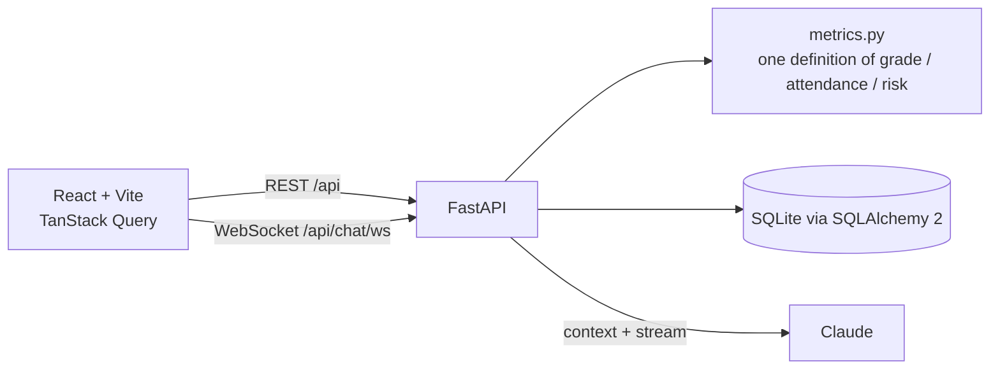

# 🦸 Super Teacher

A classroom copilot: it answers **"who needs me today, and why?"** — then helps you act on it.


## What it does
- **Today** – class stats, a ranked *needs attention* list with plain-language reasons, grade distribution.
- **Roster** – searchable, sortable, filter by status; every student has a computed average, trend, attendance and homework rate.
- **Student** – score trend, attendance strip, every assignment (missing ones flagged), private notes, and an AI insight card.
- **Gradebook** – spreadsheet-style entry per section; averages and risk update live.
- **Attendance** – one-tap daily roll call, optimistic UI.
- **Ask AI** – streaming Claude chat that sees your real roster (and the student you're viewing) — not scraped page text.

## Architecture

```mermaid
flowchart LR
  UI[React + Vite<br/>TanStack Query] -- REST /api --> API[FastAPI]
  UI -- WebSocket /api/chat/ws --> API
  API --> M[metrics.py<br/>one definition of grade / attendance / risk]
  API --> DB[(SQLite via SQLAlchemy 2)]
  API -- context + stream --> C[Claude]
```
Data model: `Course → Section → Student`, with real `Assessment`/`Score` and `AttendanceRecord` rows plus `Note` and a fingerprint-keyed `InsightCache`. Everything shown in the UI is *derived* from those rows in `superteacher/metrics.py`, so the roster, the student page, the overview and the AI context can't disagree.

AI: chat streams from `ANTHROPIC_MODEL` (default `claude-sonnet-5-5`) with the roster snapshot as a prompt-cached system block; insight cards use `ANTHROPIC_INSIGHT_MODEL` (default Haiku 4.5) and are cached until the student's data changes. With no API key everything still works — insights fall back to rule-based text.

## Run it
```bash
pip install -r requirements-dev.txt && (cd web && npm install)
export ANTHROPIC_API_KEY=sk-...        # optional
./local_test.sh                          # API :8080, UI http://localhost:4000
python -m pytest                         # backend tests
```
Production: `docker build -t superteacher . && docker run -p 8080:8080 -e ANTHROPIC_API_KEY -v data:/data superteacher`.

Config (env / `.env`): `DATABASE_URL`, `ANTHROPIC_API_KEY`, `ANTHROPIC_MODEL`, `ANTHROPIC_INSIGHT_MODEL`, `CORS_ORIGINS`, `SEED_DEMO_DATA`, `STATIC_DIR`.

## Not yet
No authentication — this holds student data, so put it behind your platform's auth (e.g. IAP) before real use. Next up: auth/roles, CSV import, parent summaries, migrations (Alembic) once the schema settles.
