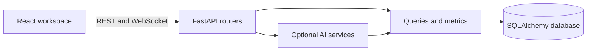

# Super Teacher

A teacher workspace for finding students who need attention and acting on grades, attendance and classroom notes. Built with React, TypeScript and FastAPI.


**Status:** active; a Cloud Run pilot is the accepted deployment shape. The public domain may still serve the older `edutrack` app, so source capabilities are not deployment evidence. Read the [release checkpoint](docs/RELEASE_CHECKPOINT.md) and [deployment status](docs/DEPLOYMENT_STATUS.md) before making release decisions.

## What it does

- **Today and roster:** class summaries, risk reasons, search, filters and CSV import.
- **Student and gradebook:** assignment scores, grade history, notes and spreadsheet-style score entry.
- **Attendance and reports:** daily roll call, assignment statistics, CSV export and editable parent-update drafts.
- **Ask AI:** streamed chat with scoped classroom tools and student insights. Rule-based insights and template parent drafts work without an API key; chat reports that AI is unavailable.
- **Authentication:** shared passcode by default; optional email-link accounts with owner-scoped data, revocable sessions, quotas, export and deletion.

## Quickstart

For a synthetic local demo on Linux/WSL, install [uv](https://docs.astral.sh/uv/getting-started/installation/), Node 22.12+ and GNU Make, then run:

```bash
make dev-check            # tools/ports only; no installation or servers
make dev                  # first run installs; later runs reuse matching locks
```

This starts the API on loopback port 8080 and Vite on loopback port 4000 with synthetic seeded data, disabled auth and no AI or email credentials; open http://localhost:4000. `./local_test.sh` is an alias.

For other platforms, an existing environment, an empty classroom, or testing login and AI, follow the [manual setup](docs/LOCAL_DEVELOPMENT.md#manual-setup) (Python 3.11+, Node 22.12+). The managed demo's safety checks and settings are in the same [local development guide](docs/LOCAL_DEVELOPMENT.md). `ANTHROPIC_API_KEY` is optional; keep credentials outside Git.

## Architecture


```mermaid
flowchart LR
  UI[React workspace] -->|REST and WebSocket| API[FastAPI routers]
  API --> Data[Queries and metrics]
  Data --> DB[(SQLAlchemy database)]
  API --> AI[Optional AI services]
  AI --> Data
```

## Layout

| Path | Contents |
| --- | --- |
| [web/](web) | React + TypeScript app (Vite) |
| [superteacher/](superteacher) | FastAPI application, routers, models and AI services |
| [alembic/](alembic) | Database migrations |
| [tests/](tests) | Python test suite |
| [e2e/](e2e) | Playwright browser and accessibility suite |
| [scripts/](scripts) | Dev launcher, benchmarks, deployment and lock tooling |
| [infra/](infra) | Terraform for the Cloud SQL plan |
| [docs/](docs) | Architecture, operations, release and planning documents |

## Documentation

- [Architecture and data boundaries](docs/architecture.mdx) and [architecture decisions](docs/adr/README.md)
- [Teacher flows, frontend and authentication](docs/teacher-workspace.mdx)
- [Local development](docs/LOCAL_DEVELOPMENT.md)
- [Configuration and deployment](docs/DEPLOYMENT.md): accounts, email and runtime settings
- [Operator runbook](docs/OPERATOR_RUNBOOK.md): deployment, rollback, recovery, credential rotation and incident triage
- [Backup and recovery](docs/BACKUP_RECOVERY.md) and [release checklist](docs/RELEASE_CHECKLIST.md)
- [Security review](docs/SECURITY_REVIEW.md) and [roadmap](docs/ROADMAP.md)
- [Browser suite findings](e2e/FINDINGS.md) and [dependency locking](scripts/update_lock.sh)
- [Full documentation index](docs/README.md)
- [AGENTS.md](AGENTS.md) and [agent architecture notes](docs/agent-architecture.md) for coding agents

## Development

CI runs Python lint/tests, web lint/types/tests/build, browser/E2E tests, Docker/auth smoke and a benchmark. Run relevant checks after changes; in shared agent workspaces, use the repository's verification owner and resource gate for broad suites, builds and installs.

```bash
ruff check . && ruff format --check .
python -m pytest
(cd web && npm run lint && npm test -- --maxWorkers=2 && npm run build)
```

The accepted Cloud Run pilot uses single-writer SQLite with Litestream/GCS recovery. Release promotion requires verified writer drain, compatible migration lineage and recovery; optional email accounts also need working delivery. Follow the existing [release checklist](docs/RELEASE_CHECKLIST.md). Roles/organisations, shared multi-instance rate limiting and broader grading policies remain roadmap work.
