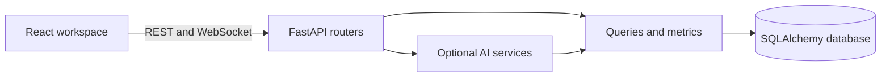

# Super Teacher

A teacher workspace for finding students who need attention and acting on grades, attendance and classroom notes. Built with React, TypeScript and FastAPI.


## Workspace

- **Today and roster:** class summaries, risk reasons, search, filters and CSV import.
- **Student and gradebook:** assignment scores, grade history, notes and spreadsheet-style score entry.
- **Attendance and reports:** daily roll call, assignment statistics, CSV export and editable parent-update drafts.
- **Ask AI:** streamed chat with scoped classroom tools and student insights. Rule-based insights and template parent drafts work without an API key; chat reports that AI is unavailable.
- **Authentication:** shared passcode by default; optional email-link accounts with owner-scoped data, revocable sessions, quotas, export and deletion.

The current React app lives in `web/`, with the API in `superteacher/`. The public domain may serve the older `edutrack` app: source capabilities are not deployment evidence. Read the [release checkpoint](docs/RELEASE_CHECKPOINT.md) and [deployment status](docs/DEPLOYMENT_STATUS.md) before making release decisions.

## Architecture


```mermaid
flowchart LR
  UI[React workspace] -->|REST and WebSocket| API[FastAPI routers]
  API --> Data[Queries and metrics]
  Data --> DB[(SQLAlchemy database)]
  API --> AI[Optional AI services]
  AI --> Data
```

[Architecture and data boundaries](docs/architecture.mdx) · [Teacher flows, frontend and authentication](docs/teacher-workspace.mdx) · [Roadmap](docs/ROADMAP.md)

## Local development

For a synthetic local demo on Linux/WSL, install [uv](https://docs.astral.sh/uv/getting-started/installation/), Node 22.12+ and GNU Make, then run:

```bash
make dev-check            # tools/ports only; no installation or servers
make dev                  # first run installs; later runs reuse matching locks
```

The bootstrap selects Python 3.12 with uv, installs hash-pinned runtime dependencies and runs `npm ci`. It starts the API on loopback port 8080 and Vite on loopback port 4000; open http://localhost:4000. Ctrl-C or a server failure stops only the two owned server groups. `./local_test.sh` is an alias for this managed demo. Ports must be free; it never stops another server. On this shared WSL workspace, setup uses `agent-heavy-check`; a busy gate exits without starting servers. Do not retry an unchanged blocked install.

The managed demo uses `.superteacher-dev/demo.db`, synthetic seeded data and disabled auth, and overrides database/provider settings from `.env`. It does not use AI/email credentials. Its private Python environment and dependency fingerprint live in `.superteacher-dev/`; `.env` and existing `.venv` are preserved. The state directory must belong to the current user and have no group/other permissions; existing database and SQLite sidecars must be private owned regular files with one link. Aliases and unsafe entries are refused without changing their targets. Servers create private files. Existing regular demo data is trusted operator-managed data: never copy classroom records into this directory; these path checks do not prove data provenance or protect against another process running as the same user. Existing unowned or symlinked `web/node_modules` is refused, so occupied worktrees should use their existing manual setup. Setup runs only through the launcher lock and shared gate; there is no standalone `--install` entry. This setup installs runtime dependencies; test/lint tooling still uses the manual developer environment below. Optional dev-container packaging and a resource-gated clean-clone installation rehearsal remain follow-ups under #42.

For other platforms, an existing environment, an empty classroom, or testing login/AI, use Python 3.11+ and Node 22.12+ with the manual flow. In separate terminals after installation:

```bash
python3 -m venv .venv
source .venv/bin/activate
pip install -r requirements-dev.txt
(cd web && npm ci)
# Terminal 1 (activate .venv): local demo only
AUTH_DISABLED=true python -m uvicorn superteacher.main:app --reload --host 127.0.0.1 --port 8080
# Terminal 2
cd web && npm run dev -- --host 127.0.0.1 --strictPort
```

Local settings default to synthetic demo seeding. Use `SEED_DEMO_DATA=false` for an empty workspace. `ANTHROPIC_API_KEY` is optional; keep credentials outside Git. To exercise passcode login in the manual flow, set `AUTH_PASSWORD` and unset `AUTH_DISABLED`. See [configuration and deployment](docs/DEPLOYMENT.md) for accounts, email and runtime settings. Shared-workspace installs in the manual flow also require the verification owner's resource gate.

## Validation and operations

Start with the [operator runbook](docs/OPERATOR_RUNBOOK.md) for deployment, rollback, recovery, credential rotation and incident triage.

CI runs Python lint/tests, web lint/types/tests/build, browser/E2E tests, Docker/auth smoke and a benchmark. Run relevant checks after changes; in shared agent workspaces, use the repository's verification owner and resource gate for broad suites, builds and installs.

```bash
ruff check . && ruff format --check .
python -m pytest
(cd web && npm run lint && npm test -- --maxWorkers=2 && npm run build)
```

[Browser suite](e2e/FINDINGS.md) · [Backup and recovery](docs/BACKUP_RECOVERY.md) · [Dependency locking](scripts/update_lock.sh) · [Architecture decisions](docs/adr/README.md)

The accepted Cloud Run pilot uses single-writer SQLite with Litestream/GCS recovery. Release promotion requires verified writer drain, compatible migration lineage and recovery; optional email accounts also need working delivery. Follow the existing [release checklist](docs/RELEASE_CHECKLIST.md). Roles/organisations, shared multi-instance rate limiting and broader grading policies remain roadmap work.
