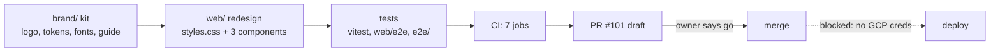

# Handoff: brand kit and Apple-style redesign

Written 2026-10-08 for an agent (or person) taking over this work cold. Everything here was verified at commit
`6d40bcd` on branch `claude/upbeat-volta-k9dtci`; re-check anything marked **verify** before relying on it.
Read [agent-architecture.md](agent-architecture.md) first for the repo map.

## 1. Where things stand

| Item | State |
| --- | --- |
| Branch / PR | `claude/upbeat-volta-k9dtci`, [PR #101](https://github.com/jckail/superteacher/pull/101), **draft** |
| CI on `6d40bcd` | all 7 jobs green: lint, api, web, browser, e2e, bench-smoke, docker |
| Merged? | No. The owner asked for "commit and push", not merge. Merge only when told to |
| `main` drift | `main` moved after this branch was cut (e.g. `b227838`, public-demo work). **Verify** whether the PR still merges cleanly; if not, merge `origin/main` into the branch (never rebase or force-push a branch with an open PR) |
| Deploy | **Not done and not possible from the sandbox**: no GCP credentials or project. Use only the guarded release path: `scripts/deploy_cloud_run.sh`, [OPERATOR_RUNBOOK.md](OPERATOR_RUNBOOK.md) and [DEPLOYMENT_STATUS.md](DEPLOYMENT_STATUS.md). The release owner verifies live state first; do not improvise gcloud commands |

## 2. What was built

**Brand kit (`brand/`)** is generated, so edit constants, not outputs.
- Idea: a book that is also a cape, with an orange spark above it. Tagline "Know who needs you today."
- Color: Cape Blue `#0B63E5` (interface), Spark Orange `#FF8A1F` (the spark: logo, AI, one highlight per screen), Midnight `#0A1F44` (wordmark). Status colors (green/amber/red) are separate and functional. Orange never signals status. Orange fill takes dark text only; white on orange is 2.4:1.
- Type: Bricolage Grotesque (SIL OFL, files in `brand/fonts/`) for the outlined wordmark and brand headlines; the system UI font in the product (no webfont loaded; the CSP is `font-src 'self'`).
- Regenerate: `brand/README.md` has the three commands (`build_brand.py`, `export_png.mjs`, `build_guide.py`). `brand-guide.html` computes its contrast table from `tokens.json`.
- Tokens live in three places and must change together: `brand/tokens.json`, `brand/tokens.css`, `web/src/styles.css`.

**Redesign (`web/`)** is almost entirely `web/src/styles.css` (tokens plus rules; legacy variable names such as `--brand`, `--muted`, `--surface-2` are kept as aliases). New files: `components/Icon.tsx` (stroke icons), `components/BrandMark.tsx` (app icon image). Edited: `App.tsx` (nav icons), `pages/Overview.tsx` (activity rings), `components/charts.tsx` (`ActivityRings`, token colors), `Student.tsx`, `Login.tsx`, `EmailLogin.tsx`, `VerifyEmail.tsx`, `web/index.html` (favicon, manifest, social tags). Assets in `web/public/`.

## 3. Rules learned the hard way (do not regress these)

CI runs axe (WCAG A/AA) in real Chromium after state changes, so anything a checker must *guess* will eventually fail.

1. **No color or opacity transitions, no opacity entrance animations.** A button that fades from disabled to enabled was caught half-transparent in CI (white on translucent blue). Only `transform`, focus `box-shadow` and the ring's `stroke-dashoffset` may transition. To reproduce this class of bug deterministically: let the control settle in its old state, flip it, then `document.getAnimations().forEach(a => { a.pause(); a.currentTime = 0 })` and run axe.
2. **Avoid translucent fills under text.** Secondary text is `#5F5F64` because `#6E6E73` on a gray fill was 4.1-4.4:1. Inputs use the opaque `--field`. Dark-mode active pills use opaque tints. Overlay surfaces (mobile tab bar, overlay chat) are ~94% opaque so contrast does not depend on what scrolls underneath.
3. **Test-pinned strings:** `Nobody is flagged. 🎉`, `Not enough data` (must appear exactly once), the stat label `Class average` (tests find it by text; the rings legend deliberately says "Overall grade"), accessible names `Ask AI` and `Sign out`.
4. Specs that encoded old design values were rewritten to compare against live values (`e2e/specs/attendance.spec.ts`, `e2e/seeded/conference.spec.ts`). Prefer that pattern over new literals.

## 4. How to verify (all commands from repo root unless noted)

| Check | Command | Last result |
| --- | --- | --- |
| Types, lint | `cd web && npm run typecheck && npm run lint` | clean |
| Unit/UI | `cd web && npx vitest run` | 439 passed (verify: count changes as `main` moves) |
| Python | `python -m pytest -q` (about 4 min) | 1725 passed, 10 skipped |
| Python lint | `ruff check . && ruff format --check .` | clean |
| Browser (web/e2e) | `cd web && npx playwright test` | 4 passed |
| Root e2e (3 projects) | `cd e2e && npx playwright test` (about 3 min) | 96 passed |

Environment gotchas:
- `cd web && npm ci` first; a stale `node_modules` fails typecheck. Same for `e2e/`.
- `npm run build` must run before the e2e suites (they serve `web/dist`).
- In the cloud sandbox Playwright's pinned browser is missing. Use a throwaway, **untracked** wrapper config that sets `launchOptions.executablePath` to `/opt/pw-browsers/chromium-1194/chrome-linux/chrome` (spread the base config; for `e2e/` map over `projects` too). Delete it before committing.
- The root e2e run stops at the first failure and reports "N did not run"; one flake hides many tests. Re-run before concluding anything.
- The sandbox proxy blocks `raw.githubusercontent.com` and Actions artifact downloads, so CI failure screenshots are unreachable. Read CI logs with the GitHub MCP `get_job_logs` instead (CI log tails show the axe rule and target).
- The app's CSP blocks injected scripts; for local axe experiments use a Playwright context with `bypassCSP: true`, never in app code.

## 5. Open items, in priority order

1. **Check PR #101 against current `main`** and merge `main` in if needed (see section 1). Re-run section 4 after.
2. **Flaky test, pre-existing:** `e2e/specs/student.spec.ts` "remove asks for confirmation" logs a 404 for the deleted student (reproduces on unmodified `main`: 3 of 16 repeated runs). Tracked as [#102](https://github.com/jckail/superteacher/issues/102) / JCK-478. If CI fails only there, re-run once; do not edit unrelated code to silence it inside this PR.
3. Tickets filed during this effort (not started): [#91](https://github.com/jckail/superteacher/issues/91) / JCK-338 serialize startup migrations with a Postgres advisory lock; [#92](https://github.com/jckail/superteacher/issues/92) / JCK-339 case-insensitive section-name uniqueness in the DB.
4. Owner decisions pending: mark PR ready and merge; deploy (needs the owner's GCP access and the release process above).
5. Nice-to-haves not done: visual-regression tooling (none exists; visuals were reviewed by hand in light, dark and 390px screenshots), Overview trend series, a class-average overlay on the student trend chart.

## 6. Working agreements (from the owner and the repo)

- Owner: Jordan Kail. Wants concise answers; small diagrams help. Linear team `JCK`, project "Super Teacher"; GitHub `jckail/superteacher`.
- Commit and push on `claude/upbeat-volta-k9dtci`; open PRs as drafts and follow `.github/pull_request_template.md`. Commit trailers: `Co-Authored-By: Claude <noreply@anthropic.com>` and the `Claude-Session:` line; do not put a model version in commits or PRs.
- Never skip, disable or quarantine a test to get green. A released Alembic revision id is never reused. No secrets or real student data anywhere.
- Destructive shell commands (bulk deletes) were denied once by the sandbox classifier; use `git rm` only when asked, and ask first.
- Session: https://claude.ai/code/session_01AeG3xTCebHPSVuNQJizny2
