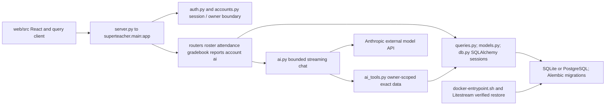

# Superteacher architecture for agents

Superteacher serves a React teacher workspace and a FastAPI backend with database-backed accounts, roster, attendance, gradebook, reports and an optional Anthropic assistant. Student and account data are application state; architecture review must not operate on a live classroom database.

`server.py` binds Uvicorn to `0.0.0.0` and `PORT` (default 8080); do not copy Hub's loopback-only service assumption into this product. `superteacher/main.py:create_app` composes middleware, dependency-overridden DB sessions, routers, health probes and startup migration/seed behavior. It rejects Cloud Run SQLite unless the verified replicated-SQLite condition holds. `db.py` sets SQLite foreign keys, WAL and busy timeout, and uses disposable in-memory schema creation versus Alembic for file/server databases. `ai.py` requires an owner ID when server-side tools are enabled, limits tool iterations, and constructs provider requests; fixture tests must avoid paid provider calls.

| Task | Source and suggested scoped checks |
| --- | --- |
| Session/account/tenant isolation | `superteacher/auth.py`, `accounts.py`, `routers/account.py`; `python -m pytest tests/test_accounts_tenancy.py tests/test_security_session.py` |
| Roster or gradebook | `routers/roster.py`, `routers/gradebook.py`, `queries.py`; select pagination/query/gradebook tests |
| AI context or tool behavior | `ai.py`, `ai_tools.py`, `ai_capacity.py`, `tests/ai_fakes.py`; select AI grounding/native tenancy tests |
| Durable storage and migrations | `db.py`, `alembic/`, `docker-entrypoint.sh`; `python -m pytest tests/test_persistence_entrypoint.py tests/test_migrations.py` |
| React UI | `web/src/`, `web/package.json`; `npm --prefix web run typecheck`, `npm --prefix web run lint` |
| Deployment | `cloudbuild.yaml`, `infra/`, `deploy.sh`, `litestream.yml`; use fixture-based deployment/config tests before any live deployment |

`pytest.ini` points to `tests/` and treats unfiltered warnings as errors. Frontend scripts use Vite on port 4000; `test:e2e` performs a build before Playwright. Full E2E needs the shared gate and a coordinated server owner, with `--workers=2` where applicable. `requirements.lock` and the web lockfile define dependencies; no installation/build was needed for this map. This review traced startup, storage and AI boundary entry points, not every endpoint or infrastructure resource. Existing `.superdesign/` work remains owned by its current author.

Sources: [server](../server.py), [app composition](../superteacher/main.py), [database](../superteacher/db.py), [AI](../superteacher/ai.py), [test policy](../pytest.ini), [web scripts](../web/package.json).

## Evidence and verification scope

Reviewed 2026-10-02 against this canonical checkout's live entry points and manifests. This is a navigation map, not proof of deployment, complete test coverage, or native harness qualification. Recheck source and Git status before implementation; sibling worktrees can contain newer behavior. Shared Graphify was queried first: the CLI returned Agent Hub symbols, but the broad query also matched unrelated repositories and was truncated; the direct HTTP request timed out. Other repositories below were verified through live source rather than assuming graph coverage.

Coordinate one verification owner before builds, broad tests, installs, or browser checks. In WSL use `/home/jkail/.local/bin/agent-heavy-check -- <command>` in the foreground, with two workers where supported. The commands below are suggested checks from live manifests, **not checks run by this documentation review**. Use disposable state and never operate on another agent's live service merely to verify documentation.
