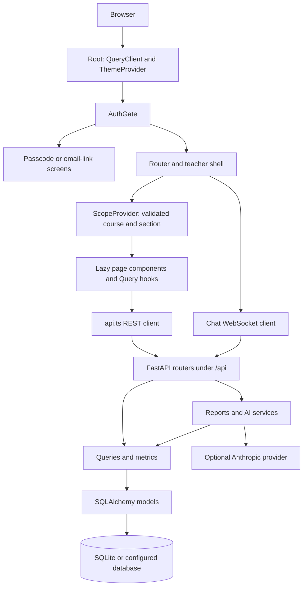
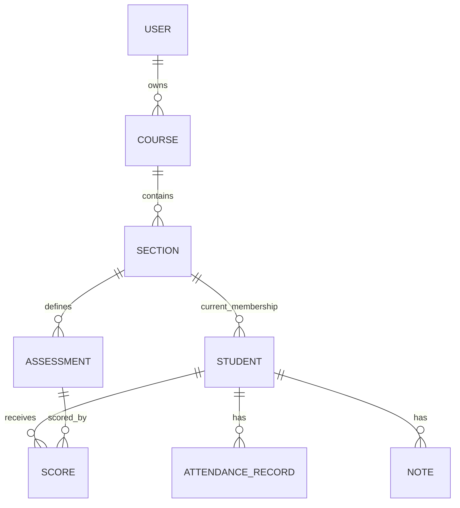

# Super Teacher architecture

This describes the native application in this repository, verified against source at `1cde1cc`. It does not describe the legacy `edutrack` deployment or establish that current source is serving a public domain. Release observations belong in [DEPLOYMENT_STATUS.md](DEPLOYMENT_STATUS.md) and [RELEASE_CHECKPOINT.md](RELEASE_CHECKPOINT.md).

## Request and rendering paths

The browser root owns the query client and replaces it on private-session reset, isolating old requests from the next session. Theme state wraps authentication so the selected theme continues across sign in and sign out. The shell owns navigation, route focus, the optional AI panel, and account controls; pages load lazily.

Sources: [main.tsx](../web/src/main.tsx), [App.tsx](../web/src/App.tsx), [auth.tsx](../web/src/auth.tsx), [scope.tsx](../web/src/scope.tsx), [api.ts](../web/src/api.ts), [server application](../superteacher/main.py).

FastAPI registers auth and resource routers under `/api`, applies request/security middleware, runs schema migrations at startup, and serves the built SPA from `STATIC_DIR` when present. Vite proxies API traffic during development. API types in [types.ts](../web/src/types.ts) are compile-time contracts; server [schemas.py](../superteacher/schemas.py) performs runtime validation.

## Classroom data and scope

This is a simplified relationship view. [models.py](../superteacher/models.py) also records enrollment history, sessions, login tokens and insight cache entries. Section transfer preserves historical associations; the active section is not the full history. Owner scoping belongs on the server, independently of the browser's selected course/section.

[metrics.py](../superteacher/metrics.py) defines derived grade, attendance and risk calculations. [queries.py](../superteacher/queries.py), [report_summary.py](../superteacher/report_summary.py) and [reports.py](../superteacher/reports.py) assemble the relevant envelopes. Roster pages use bounded server pagination via [roster_pagination.py](../superteacher/roster_pagination.py) and [useRosterPage.ts](../web/src/useRosterPage.ts).

A shared calculation definition does not imply a shared transaction snapshot across endpoints. Responses and AI artifacts may represent different reads. Overview and Reports show server `as_of` cutoffs and use the school calendar to request newer calculations; cached results can remain visible while a refresh fails. See [calendar.py](../superteacher/calendar.py), [schoolCalendar.ts](../web/src/schoolCalendar.ts) and the mounted calendar tests.

## AI and teacher review

Chat uses `/api/chat/ws`; its tools query owner-scoped classroom data rather than trusting student IDs supplied by the model. [ai_tools.py](../superteacher/ai_tools.py) bounds/sanitizes tool output. [ai.py](../superteacher/ai.py) handles provider work and fallback insights; [ai_capacity.py](../superteacher/ai_capacity.py) bounds concurrent work and deadlines. Accounts mode adds daily quotas. These controls reduce exposure and resource use; generated explanations still need teacher review.

Parent updates are editable drafts, not automatically sent emails. Browser clipboard denial leaves the draft available for manual copying. Insight caching and chat context have their own lifetimes; they do not establish live snapshot isolation. Provider model defaults and limits are defined in [config.py](../superteacher/config.py).

## Persistence and release boundaries

Local development defaults to SQLite. The accepted Cloud Run pilot restores SQLite before startup and replicates to GCS with Litestream; it retains a single-writer deployment constraint. PostgreSQL support and CI coverage do not establish an approved multi-writer production migration.

Follow [ADR 0001](adr/0001-persistence.md), [backup/recovery](BACKUP_RECOVERY.md) and [deployment instructions](DEPLOYMENT.md). No-traffic candidates can still write their replica prefix when invoked. Existing staging ownership, writer drain, migration lineage, recovery and rollback must be verified by the release operator. This document supplies no operator attestations.
