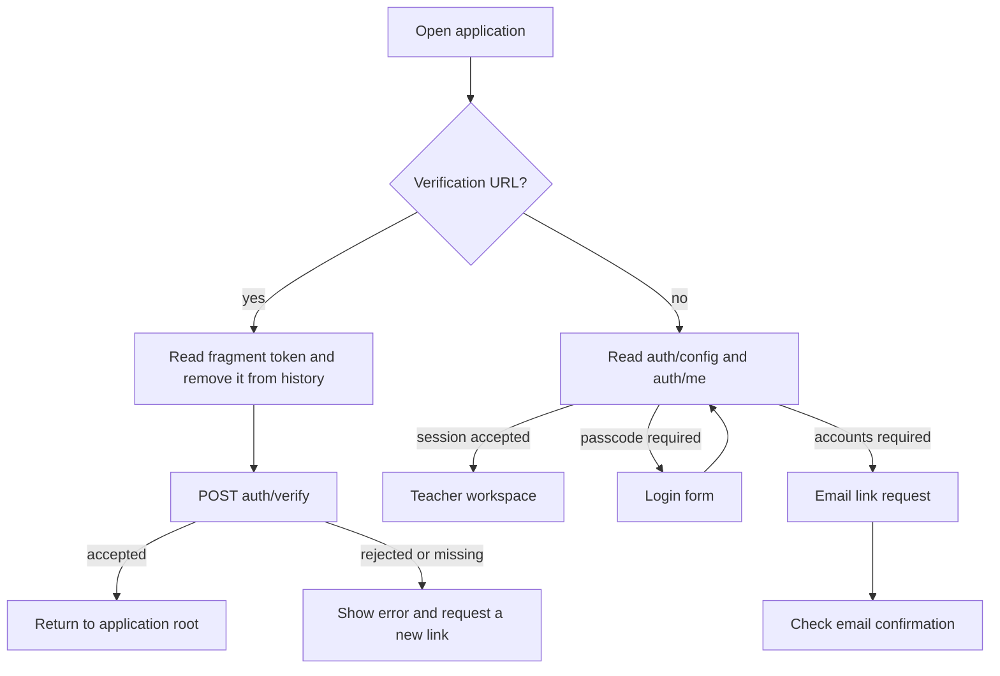

# Teacher workspace and frontend guide

Current source provides the following flows. Source completion is separate from deployment acceptance. Start with the [operator runbook](OPERATOR_RUNBOOK.md) and [deployment status ledger](DEPLOYMENT_STATUS.md); dated entries do not establish what is serving now. The release owner must confirm the actual serving revision, image and domain target through runtime readback. The [release checkpoint](RELEASE_CHECKPOINT.md) retains historical release and owner context.

## Page map

| Route or state | Teacher action | Source |
| --- | --- | --- |
| `/` | Review class totals and students needing attention | [Overview.tsx](../web/src/pages/Overview.tsx) |
| `/roster` | Search/filter, import CSV, manage students and sections | [Roster.tsx](../web/src/pages/Roster.tsx) |
| `/students/:id` | Review assignments/history, attendance, notes and insight | [Student.tsx](../web/src/pages/Student.tsx) |
| `/students/:id/conference` | Review a selected student’s conference sheet, then print or save a PDF | [ConferenceSheet.tsx](../web/src/pages/ConferenceSheet.tsx) |
| `/gradebook` | Enter section scores and manage assessments | [Gradebook.tsx](../web/src/pages/Gradebook.tsx) |
| `/attendance` | Mark the selected day's roll call | [Attendance.tsx](../web/src/pages/Attendance.tsx) |
| `/reports` | Inspect statistics, export CSV, edit/copy parent drafts | [Reports.tsx](../web/src/pages/Reports.tsx) |
| Ask AI panel | Ask scoped classroom questions | [Chat.tsx](../web/src/components/Chat.tsx) |

Course/section selection is validated after metadata loads. An unavailable saved selection displays a recoverable state rather than silently broadening its scope. Server authorization applies even when browser scope or IDs change. School-day cutoffs follow the configured school timezone; browser-local dates alone are not evidence that a summary is current.

## Conference sheets

In Roster, choose **Conference sheet** beneath the student's name. Review the selected student's average, trend, attendance through the displayed school day and unscored assignments due by the displayed school-day cutoff. Uncheck missing-work items you do not want to include. Scored zero is not missing work, and future unscored assignments are excluded.

Private notes start unchecked. Select only the notes you intend to share; consent binds the exact note text. Observed changes or removal require approval again, and changing students or sessions resets the selection. The sheet reads existing student data rather than generating AI content. An independently opened assistant retains the selected student's context, but its transcript and account dialogs are excluded from conference print output.

Use **Refresh summary** if needed, then **Print conference sheet** to print or save a PDF. Printing requires a successful, unpaused read whose cutoff matches the current school day and content that fits the one-page Letter sheet. Include fewer notes or assignments if it exceeds one page. Native print shows a warning instead of the preview when the sheet is not ready. A matching date is a cutoff check, not proof that no same-day record changed after the read; review the preview and handle the saved PDF or paper as private student information.

## Small-group suggestions

[PR86](https://github.com/jckail/superteacher/pull/86) adds the following workflow below the Gradebook score table. It is implemented in source and awaits deployment acceptance; confirm the serving revision with the release owner before expecting it in a deployed workspace.

Select a section in **Gradebook** and finish score or assessment edits. Under **Small-group builder**, choose **Shared unscored assignment** and a due assignment, or **Weak assignment type**, an assignment type and a percentage threshold. Unscored means no recorded score; it does not establish that work was not submitted. A recorded zero is scored work. Weak-type percentages use graded assignments weighted by possible points, preserve extra credit and exclude future or unscored work; students without enough evidence are excluded. **Recorded evidence for group** shows the assignments behind each suggestion.

Choose **Maximum students per group** from 1 to 12 and review the members. Check **Include group … in suggested plan** for each group you want. Choose a **Reteach date** on or after the displayed school day, an **Available start time (school time)** and **Minutes per group** from 5 to 60, then select **Suggest reteach slots**. Slots run consecutively and must finish before midnight. The teacher chooses availability; suggestions stay on the page and do not reserve calendar time or save an intervention record.

Changing grouping settings, included groups or scheduling settings removes the suggested plan so it can be regenerated. New score evidence, a section or session change, a school-day or time-zone change, or a failed/paused read clears the review. Actions are withheld while reads or score changes are unsettled. An unchanged background school-calendar check preserves the review and restores the focused control unless focus has moved elsewhere.

## Authentication modes

[AuthGate](../web/src/auth.tsx) resolves the configured mode and current session. Passcode is the default; accounts mode is explicitly enabled. Email requests show a deliberately generic confirmation and a resend cooldown. Verification tokens stay in the URL fragment, are removed from browser history, and are consumed by a POST. The verification screen handles missing/expired links with a recovery action.

Account controls provide sign out, sign out everywhere, data export and a typed-email deletion confirmation. Server-side sessions are revocable. Root replaces the private query client at session reset; browser scope/chat state is cleared so a shared computer does not carry one session's private view into the next. Sources: [EmailLogin.tsx](../web/src/pages/EmailLogin.tsx), [VerifyEmail.tsx](../web/src/pages/VerifyEmail.tsx), [AccountMenu.tsx](../web/src/components/AccountMenu.tsx), [accounts.py](../superteacher/accounts.py), [auth.py](../superteacher/auth.py).

These are implemented flows, not proof of real email delivery. Provider/SMTP configuration, migration lineage and production acceptance remain in the release runbooks. Use synthetic identities/data for demo and account-flow verification; do not publish tokens, student records or private backups as design artifacts.

## Editing, feedback and access

Gradebook cells save through the API; test or teacher navigation should wait for confirmed saves before assuming a reload will preserve an edit. Attendance uses optimistic feedback and rollback/error handling. Parent-draft generation and copying guard against stale requests after selection changes or unmounting; a failed clipboard copy announces a manual fallback without removing the text.

The shell provides a skip link and navigation focus announcement. Attendance uses student row headers and status column headers, including mobile wrapping for long names. Dense table/chart regions are named and keyboard-focusable with visible focus styles. The theme uses a shared saved preference and system font stack. These are specific affordances, not a universal accessibility certification.

## Contributor checks

Use synthetic fixtures and the relevant focused tests before changing these boundaries:

| Change | Existing checks |
| --- | --- |
| Session transport and privacy reset | `Auth.test.tsx`, `AuthTransport.test.tsx`, `Accounts.test.tsx` |
| Selection hydration and pagination | `ScopeHydration.test.tsx`, `ReportPicker.test.tsx` |
| Cutoff refresh and retained drafts | `OverviewCalendar.test.tsx`, `ReportsCalendar.test.tsx` |
| Copy feedback and table semantics | `Operations.test.tsx`, `Accessibility.test.tsx` |
| Conference identity, note consent, current-day/fit gates and print privacy | [ConferenceSheet.test.tsx](../web/src/test/ConferenceSheet.test.tsx), [conference E2E/PDF fixtures](../e2e/seeded/conference.spec.ts) |
| Small-group evidence, calendar freshness, pending writes and focus restoration | [smallGroups.test.ts](../web/src/test/smallGroups.test.ts), [SmallGroupBuilder.test.tsx](../web/src/test/SmallGroupBuilder.test.tsx), [SmallGroupIntegration.test.tsx](../web/src/test/SmallGroupIntegration.test.tsx), [seeded browser fixtures](../e2e/seeded/small-groups.spec.ts) |
| Real mobile/keyboard workflows | [E2E specs](../e2e/specs) and [findings](../e2e/FINDINGS.md) |

Frontend unit tests live in [web/src/test](../web/src/test); CI also builds and drives the actual application. Follow shared-workspace resource limits for installs, builds and broad browser suites. The [architecture guide](architecture.mdx) explains server dependencies; existing deployment and recovery documents remain the authority for operating services.
