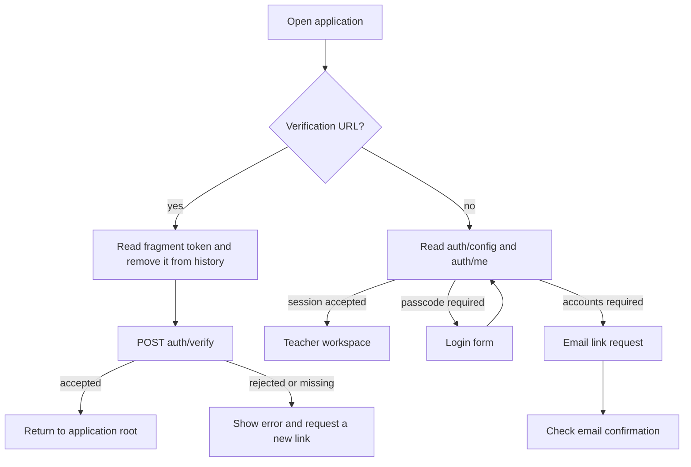

# Teacher workspace and frontend guide

Current source provides the following flows. Screens and source imports are separate from release acceptance; consult the [release checkpoint](RELEASE_CHECKPOINT.md) for the deployment currently serving users.

## Page map

| Route or state | Teacher action | Source |
| --- | --- | --- |
| `/` | Review class totals and students needing attention | [Overview.tsx](../web/src/pages/Overview.tsx) |
| `/roster` | Search/filter, import CSV, manage students and sections | [Roster.tsx](../web/src/pages/Roster.tsx) |
| `/students/:id` | Review assignments/history, attendance, notes and insight | [Student.tsx](../web/src/pages/Student.tsx) |
| `/gradebook` | Enter section scores and manage assessments | [Gradebook.tsx](../web/src/pages/Gradebook.tsx) |
| `/attendance` | Mark the selected day's roll call | [Attendance.tsx](../web/src/pages/Attendance.tsx) |
| `/reports` | Inspect statistics, export CSV, edit/copy parent drafts | [Reports.tsx](../web/src/pages/Reports.tsx) |
| Ask AI panel | Ask scoped classroom questions | [Chat.tsx](../web/src/components/Chat.tsx) |

Course/section selection is validated after metadata loads. An unavailable saved selection displays a recoverable state rather than silently broadening its scope. Server authorization applies even when browser scope or IDs change. School-day cutoffs follow the configured school timezone; browser-local dates alone are not evidence that a summary is current.

## Authentication modes

[AuthGate](../web/src/auth.tsx) resolves the configured mode and current session. Passcode is the default; accounts mode is explicitly enabled. Email requests show a deliberately generic confirmation and a resend cooldown. Verification tokens stay in the URL fragment, are removed from browser history, and are consumed by a POST. The verification screen handles missing/expired links with a recovery action.

Account controls provide sign out, sign out everywhere, data export and a typed-email deletion confirmation. Server-side sessions are revocable. Root replaces the private query client at session reset; browser scope/chat state is cleared so a shared computer does not carry one session's private view into the next. Sources: [EmailLogin.tsx](../web/src/pages/EmailLogin.tsx), [VerifyEmail.tsx](../web/src/pages/VerifyEmail.tsx), [AccountMenu.tsx](../web/src/components/AccountMenu.tsx), [accounts.py](../superteacher/accounts.py), [auth.py](../superteacher/auth.py).

These are implemented flows, not proof of real email delivery. Provider/SMTP configuration, migration lineage and production acceptance remain in the release runbooks. Use synthetic identities/data for demo and account-flow verification; do not publish tokens, student records or private backups as design artifacts.

## Editing, feedback and access

Gradebook cells save through the API; test or teacher navigation should wait for confirmed saves before assuming a reload will preserve an edit. Attendance uses optimistic feedback and rollback/error handling. Parent-draft generation and copying guard against stale requests after selection changes or unmounting; a failed clipboard copy announces a manual fallback without removing the text.

The shell provides a skip link and navigation focus announcement. Attendance uses student row headers and status column headers, including mobile wrapping for long names. Dense table/chart regions are named and keyboard-focusable with visible focus styles. The theme uses a shared saved preference and system font stack. These are specific affordances, not a universal accessibility certification.

## Contributor checks

Use synthetic fixtures and the relevant focused tests before changing these boundaries:

| Change | Existing checks |
| --- | --- |
| Session transport and privacy reset | `Auth.test.tsx`, `AuthTransport.test.tsx`, `Accounts.test.tsx` |
| Selection hydration and pagination | `ScopeHydration.test.tsx`, `ReportPicker.test.tsx` |
| Cutoff refresh and retained drafts | `OverviewCalendar.test.tsx`, `ReportsCalendar.test.tsx` |
| Copy feedback and table semantics | `Operations.test.tsx`, `Accessibility.test.tsx` |
| Real mobile/keyboard workflows | [E2E specs](../e2e/specs) and [findings](../e2e/FINDINGS.md) |

Frontend unit tests live in [web/src/test](../web/src/test); CI also builds and drives the actual application. Follow shared-workspace resource limits for installs, builds and broad browser suites. The [architecture guide](architecture.mdx) explains server dependencies; existing deployment and recovery documents remain the authority for operating services.
